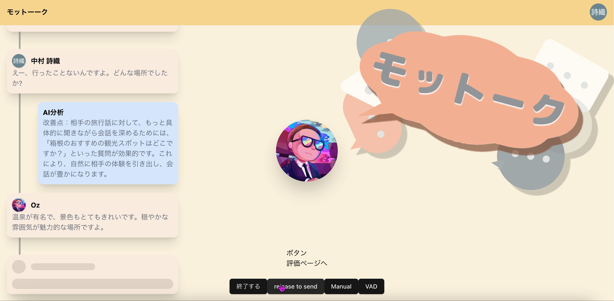
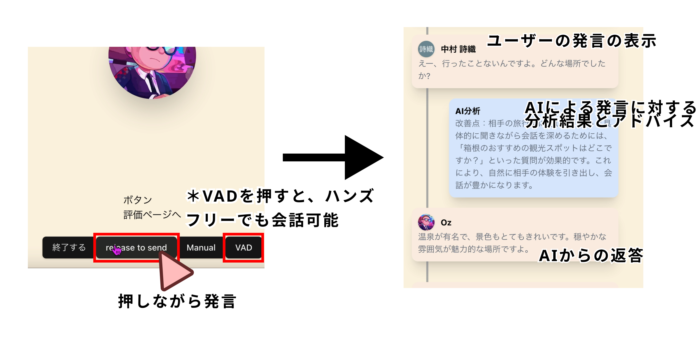
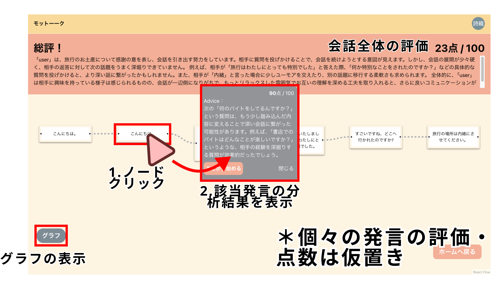
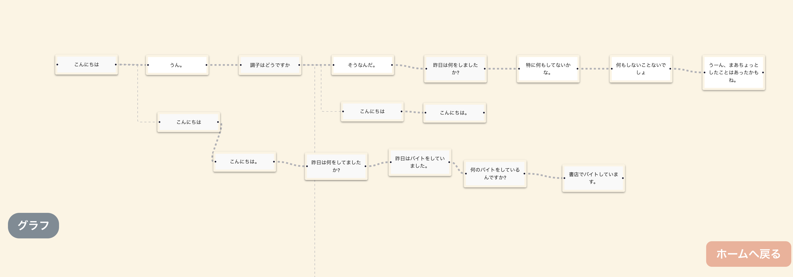
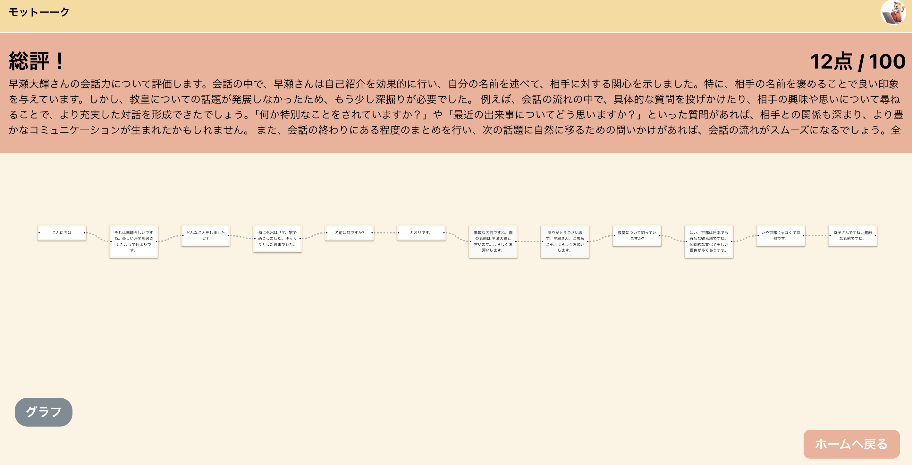
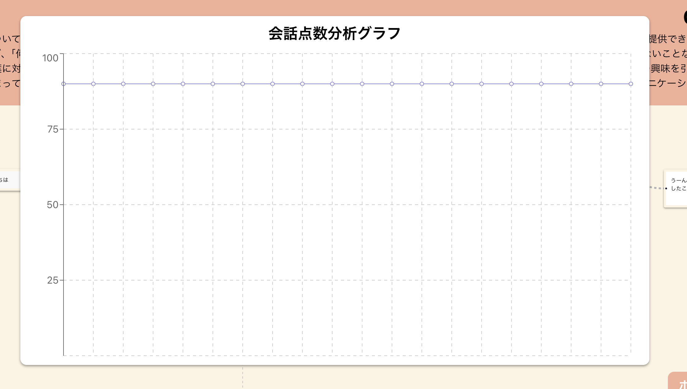

# モットーク！

> [デモ動画はこちら](https://youtu.be/QIW8d9J9BSU)

## 製品概要
### 背景(製品開発のきっかけ、課題等）
新型コロナウイルスによる行動の制限は解除され、かつてのように人とコミュニケーションを取れるようになりました。しかし、その爪痕はいまだに残っています。コロナウイルスの行動制限により、人とのコミュニケーションが減少したことで、人とのコミュニケーション能力が低下しているという報告があります。

会話を盛り上げるためには、適切な質問が重要です。質問力の上達には会話の経験を積むことが必要です。しかし、会話に苦手意識を持つ人にとって、経験を積むことは容易ではありません。

### 製品説明（具体的な製品の説明）
私たちが開発した「モットーク！」は、AIとの会話を通してあなたの質問力を点数化し、アドバイスを送ります。

#### 基本機能説明
1. ホーム画面の「スタート」ボタンを押して、トーク画面に移動します。
2. トーク画面の「release to send」ボタンを押しながら発言する。これに対し、システム側から返答とその発言に対する分析結果が返ってきます

3. 会話を終えたら（任意のタイミング）で「評価ページへ」ボタンを押して、結果ページに移動します
4. 結果ページでは、会話全体の総評と点数、会話のフローを見ることができます
   - （それぞれの発言の分析結果、発言の点数とグラフは仮置き状態）

### 特長
モットーク！は会話の練習に最適な相手を用意し、正確なアドバイスを送ることができます。

#### 1. 特長1
モットーク！の会話相手は驚くほどに自然です。通常、LLMと会話を行うと、実際の人間との会話に比べて、会話の流れが不自然になります。しかし、モットーク！はそのようなことはありません。口調、量、内容、その他の会話の流れが自然です。

#### 2. 特長2
モットーク！の会話相手には人生があります。好きなもの、過去の思い出、将来の夢、日々の過ごし方。それらを持った会話相手は、どのような質問でも豊かな回答が返ってきます。しかも、人物の属性の組み合わせは100万通り以上あり、それに基づいて生成AIが背景を生成するため、無限の会話相手が存在します。

#### 3. 特長3
モットーク！のアドバイスには根拠があります。会話についての複数のベストベラー書籍を基に、アドバイスを行っています。AIがその場で思いついて適当なアドバイスではありません。安心してアドバイスに従ってください。必ず質問力が上達します。

### 解決出来ること
一人でも会話の経験を積むことができ、質問力を上達させることができる。

### 今後の展望
* 好きな場所から会話を再開し、思考錯誤ができるリプレイ機能
* それをGitHubのブランチのような木構造で管理する機能。
* 会話についての文献の調査を進め、より正確なアドバイス、点数化を行う。
* 会社の上司や営業など、TPOを設定し、その場に合わせて実践的なアドバイスを送る。
* 会話によってAI側から引き出した情報をリスト化・プロファイルすることで、現状の質問力と成果の確認ができるようにする

### 注力したこと（こだわり等）
* プロンプトのチューニングにこだわり続けました。対話の自然さ、アドバイスの正確を追求しました。
* 会話相手の背景を生成し、豊かな会話を行えるようにしました。
  - 職業・趣味・性格から、夢や嫌なことなどに至るまでの様々な項目に対し、それぞれ可能な限りの候補を用意
  - そこからランダムに選択させ、様々な個性を持った相手と会話することが可能に！
  - 生成したパーソナリティをもとに、1週間の習慣などを生成。「最近いいことあった？」などより現実味のある対話が可能に
* 1つ1つの発言をノード化し会話の流れをフローチャートで表現したり、評価点数を折れ線グラフで表現するなどの可視化により、見返しやすいUIとなるようこだわりました

  
  

## 開発技術
### 活用した技術
#### API・データ
* OpenAI API

#### フレームワーク・ライブラリ・モジュール
* Next.js
* React
* Supabase
* React Flow
* Recharts

#### デバイス
* ブラウザ（PC）

### 独自技術
#### ハッカソンで開発した独自機能・技術
* 会話をブランチで管理しています。時間の都合で間に合いませんでしたが、リプレイ機能の実装が完了すれば、会話のツリーが作成されます。
* より自然かつこちらの質問力が鍛えられるような対話を実現するためのプロンプト設計・開発。
  - 必要最低限の返答を徹底させることで、テンポの良い会話が可能に
